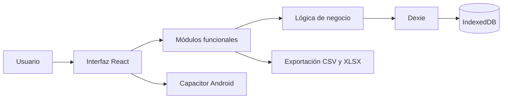

# LifeOS

[](https://github.com/EstivenGg/LifeOS/actions/workflows/ci.yml)
[](https://github.com/EstivenGg/LifeOS/actions/workflows/deploy.yml)

LifeOS es una aplicación web para organizar y registrar diferentes aspectos de la vida diaria desde un solo lugar. Permite gestionar tareas, hábitos, entrenamientos, sueño, estudio, lectura, consumo de agua, peso, tiempo de pantalla y otras actividades personales.

La aplicación utiliza una arquitectura **local-first**: la información se almacena directamente en el navegador mediante IndexedDB. Esto permite utilizar el sistema sin crear una cuenta, sin depender de un servidor y conservando el control de los datos.

## Aplicación en producción

- **Aplicación:** [https://estivengg.github.io/LifeOS/](https://estivengg.github.io/LifeOS/)
- **Repositorio:** [https://github.com/EstivenGg/LifeOS](https://github.com/EstivenGg/LifeOS)
- **Ejecuciones de CI/CD:** [GitHub Actions](https://github.com/EstivenGg/LifeOS/actions)

## Funcionalidades

- Dashboard con resumen general y métricas recientes.
- Registro diario de estado de ánimo, sueño, agua, peso y notas.
- Gestión de tareas, subtareas, listas y tareas recurrentes.
- Administración de hábitos y categorías.
- Seguimiento de libros, páginas leídas y progreso de lectura.
- Registro de películas y series.
- Creación de rutinas y sesiones de entrenamiento.
- Cálculo de volumen, repeticiones y estimación de fuerza.
- Seguimiento del sueño y su calidad.
- Registro de sesiones de estudio.
- Temporizador Pomodoro.
- Seguimiento del tiempo de pantalla.
- Calendario para consultar registros por fecha.
- Panel de estadísticas e indicadores.
- Exportación de información en formatos CSV y XLSX.
- Interfaz adaptable para escritorio y dispositivos móviles.
- Aplicación Android mediante Capacitor.

## Tecnologías

| Área | Tecnología |
| --- | --- |
| Interfaz | React 18 |
| Lenguaje | TypeScript |
| Construcción | Vite |
| Estilos | Tailwind CSS |
| Navegación | React Router |
| Persistencia | IndexedDB y Dexie |
| Estado | Zustand |
| Gráficos | Recharts |
| Calendario | FullCalendar |
| Animaciones | Framer Motion |
| Exportación | PapaParse y SheetJS |
| Aplicación móvil | Capacitor |
| Pruebas unitarias | Vitest |
| Pruebas E2E | Playwright |
| Calidad de código | ESLint |
| CI/CD | GitHub Actions |
| Producción | GitHub Pages |

## Arquitectura

LifeOS es una aplicación frontend de una sola página o **SPA**. Los componentes de React utilizan servicios y módulos de lógica de negocio para consultar y modificar la base de datos local.



### Capas principales

1. **Presentación:** páginas, componentes reutilizables, formularios y navegación.
2. **Dominio:** cálculos, recurrencias, filtros, validaciones y operaciones de cada módulo.
3. **Persistencia:** almacenamiento local mediante Dexie e IndexedDB.
4. **Plataforma:** Vite para web y Capacitor para Android.

## Estructura del proyecto

```text
LifeOS/
├── .github/workflows/    # Integración y despliegue continuo
├── android/              # Proyecto Android generado por Capacitor
├── e2e/                  # Pruebas End-to-End con Playwright
├── public/               # Archivos públicos
├── src/
│   ├── components/       # Componentes reutilizables
│   ├── context/          # Contextos globales
│   ├── data/             # Modelos, base de datos y datos iniciales
│   ├── features/         # Módulos funcionales de la aplicación
│   ├── hooks/            # Hooks personalizados
│   ├── services/         # Integraciones con la plataforma
│   ├── test/             # Configuración de pruebas
│   └── utils/            # Funciones utilitarias
├── playwright.config.ts  # Configuración de pruebas E2E
├── vitest.config.ts      # Configuración de pruebas y cobertura
└── vite.config.ts        # Configuración de Vite
```

## Requisitos

- Node.js 22 o superior.
- npm.
- Un navegador moderno con soporte para IndexedDB.

## Instalación

Clonar el repositorio:

```bash
git clone https://github.com/EstivenGg/LifeOS.git
cd LifeOS
```

Instalar las dependencias:

```bash
npm install
```

Iniciar el servidor de desarrollo:

```bash
npm run dev
```

La aplicación estará disponible normalmente en:

```text
http://localhost:5173
```

## Ejecución en producción local

Generar la versión optimizada:

```bash
npm run build
```

Previsualizar el resultado:

```bash
npm run preview
```

Los archivos compilados se generan en el directorio `dist/`.

## Variables de entorno

La versión actual no necesita credenciales ni variables de entorno obligatorias. La información se guarda en IndexedDB dentro del navegador del usuario.

Si en el futuro se integra una API externa, las variables públicas de Vite deberán utilizar el prefijo `VITE_` y no deberán contener secretos.

## Pruebas

El proyecto cuenta con pruebas unitarias, de integración y End-to-End.

### Pruebas unitarias

```bash
npm run test:unit
```

Cubren utilidades de fechas, métricas de entrenamiento, filtros de contenido y captura rápida de tareas.

### Pruebas de integración

```bash
npm run test:integration
```

Validan la interacción entre la lógica de tareas y la base de datos IndexedDB, incluyendo recurrencias, estados, listas y eliminación de series.

### Cobertura

```bash
npm run test:coverage
```

El proyecto exige un mínimo automático del **85 %** de cobertura. El reporte HTML se genera en:

```text
coverage/index.html
```

Resultados obtenidos durante la implementación:

| Métrica | Cobertura |
| --- | ---: |
| Líneas | 100 % |
| Funciones | 100 % |
| Sentencias | 99,67 % |
| Ramas | 96,69 % |

### Pruebas End-to-End

Instalar Chromium para Playwright la primera vez:

```bash
npx playwright install chromium
```

Ejecutar los tres flujos E2E:

```bash
npm run test:e2e
```

Los flujos comprueban:

1. Creación de una tarea mediante captura rápida.
2. Creación de un hábito.
3. Registro de una película en la biblioteca.

El reporte se almacena en `playwright-report/`.

## Calidad del código

Ejecutar ESLint:

```bash
npm run lint
```

Validar el build:

```bash
npm run build
```

## CI/CD

El repositorio utiliza dos workflows de GitHub Actions:

### Integración continua

El workflow `.github/workflows/ci.yml` se ejecuta automáticamente en cada Pull Request hacia `main`.

Realiza los siguientes pasos:

1. Instalación de dependencias con `npm ci`.
2. Análisis del código con ESLint.
3. Build de producción.
4. Pruebas unitarias y de integración con cobertura.
5. Instalación de Chromium.
6. Ejecución de las pruebas End-to-End.
7. Publicación del reporte de Playwright como artefacto cuando ocurre un fallo.

### Despliegue continuo

El workflow `.github/workflows/deploy.yml` se ejecuta con cada actualización de la rama `main`. Construye la aplicación y publica el contenido de `dist/` en GitHub Pages.

## Persistencia de datos

Los datos se almacenan en IndexedDB mediante Dexie. Entre las tablas principales se encuentran:

- `dailyEntries`
- `habits`
- `habitCategories`
- `tasks`
- `taskLists`
- `books`
- `authors`
- `routines`
- `routineExercises`
- `entryWorkouts`
- `mediaItems`
- `pomodoroSessions`
- `entryStudy`
- `entryAppUsage`

Al abrir la aplicación por primera vez se cargan datos de demostración para facilitar la exploración de sus módulos.

## API y Swagger

LifeOS no utiliza una API REST ni un backend en su arquitectura actual. Las operaciones se realizan directamente entre la aplicación y la base de datos local IndexedDB.

Por esta razón no existen endpoints HTTP que deban documentarse con Swagger u OpenAPI. La ausencia de Swagger corresponde a una decisión arquitectónica del enfoque local-first y no a una funcionalidad incompleta.

## Aplicación Android

Para compilar y sincronizar la aplicación web con Capacitor:

```bash
npm run android:dev
```

Para abrir el proyecto nativo:

```bash
npm run android:open
```

La compilación nativa requiere Android Studio y el SDK de Android.

## Consideraciones de privacidad

- Los datos permanecen en el dispositivo del usuario.
- No se envía información personal a un servidor propio.
- Limpiar los datos del navegador también puede eliminar la información almacenada.
- La información no se sincroniza automáticamente entre dispositivos.

## Autores

Proyecto académico desarrollado por el equipo de LifeOS.

Repositorio mantenido por [EstivenGg](https://github.com/EstivenGg).
